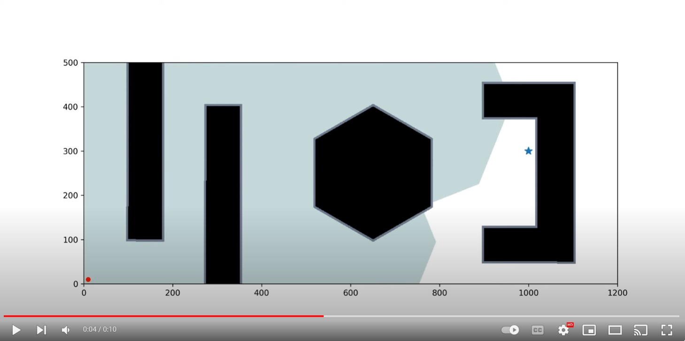

# Dijkstra's Algorithm
Implementation of the Dijkstra's algorithm in Python

## Script

To run the demo, use the following command:
```
python dijkstra_ji_liu.py
```
The script would ask the user to input the x and y coordinate of the initial and goal locations, until valid inputs are received. 

The packages required to run:
```
numpy
heapq
matplotlib
ffmpeg
```


[](https://www.youtube.com/watch?v=6OyWcB8jMJs)
